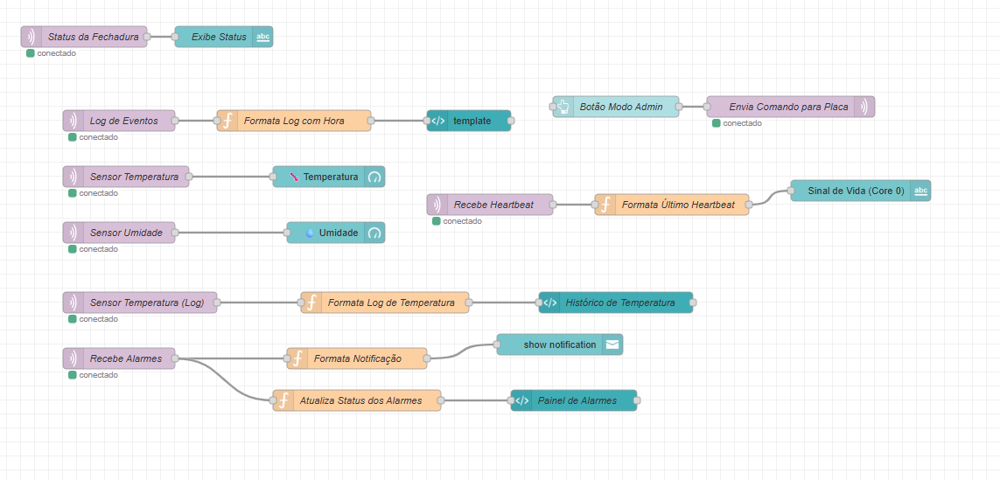
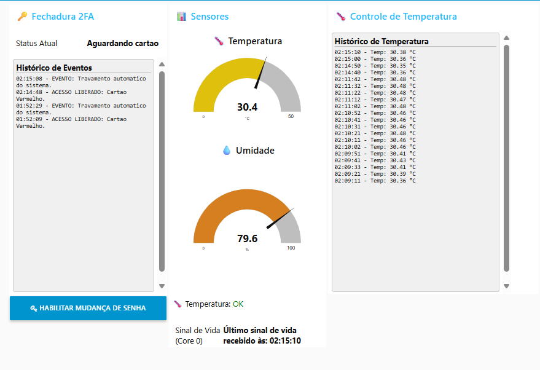

# Projeto 2: Caixa de Amostras Monitorada com BitDogLab


Desenvolvido na plataforma BitDogLab, uma placa de desenvolvimento baseada no Raspberry Pi Pico W, para simular uma fechadura eletrônica com monitoramento em tempo real de umidade e temperatura, aplicados à segurança e integridade de amostras sensíveis.

## 🎯 Objetivo Pedagógico

O principal objetivo deste projeto é familiarizar o estudante com:

* **Entrada e Saída Digital (GPIO):** Interação direta com sensores digitais (como o teclado matricial), LEDs e outros atuadores simples.
* **Comunicação I2C:** Leitura de dados de sensores complexos (sensor de cor TCS34725) e controle de um display OLED para feedback visual.
* **Controle de PWM:** Acionamento de um servo motor para simular a abertura/fechamento de uma porta.
* **Lógica de Estados:** Implementação de uma máquina de estados robusta para gerenciar o fluxo complexo do sistema.
* **Leitura Simultânea de Múltiplos Sensores:** Integração e aquisição de dados de diferentes tipos de sensores (temperatura, umidade e cor).
* **Lógica de Alarmes:** Implementação de rotinas para detectar condições fora dos limites ideais e acionar alertas.
* **Publicação de Dados Ambientais:** Envio contínuo de telemetria (temperatura, umidade) para um dashboard remoto via MQTT.
* **Monitoramento Remoto e Notificações:** Visualização de gráficos e recebimento de alertas no Node-RED.
* **Conectividade Wi-Fi e MQTT:** Publicação de eventos e status do sistema em tempo real para um dashboard remoto, habilitando a monitorização e interação via IoT.
* **Processamento Dual-Core (RP2040):** Demonstração da otimização de desempenho através do *offloading* de tarefas de rede para o Core 1, liberando o Core 0 para a lógica crítica da aplicação, otimizando o desempenho do Core 0 para a lógica da aplicação e leitura de múltiplos sensores.
* **Programação Não-Bloqueante:** Foco na implementação de drivers e lógica que permitem a execução de múltiplas tarefas sem interrupções (polling e timers), garantindo um sistema responsivo.

## ✨ Funcionalidades Principais

O sistema combina as funcionalidades do Projeto 1 (BitDogLock 2FA) com o monitoramento ambiental crítico:
1.  **Mecanismo de Autenticação (Herdado):** Preserva o sistema de controle de acesso 2FA (cartão de cor + senha numérica) do Projeto 1, para proteger o acesso à caixa.
2.  **Monitoramento Contínuo:** Leitura em tempo real e periódica de temperatura e umidade internas da caixa de amostras (sensor AHT10).
3.  **Lógica de Alarmes:** Acionamento de alertas locais (buzzer, LEDs, display) e envio de notificações remotas ao dashboard Node-RED caso a temperatura ou umidade ultrapassem limites pré-definidos.
4.  **Visualização de Dados:** Exibição dos dados de temperatura e umidade no display OLED local e gráficos em tempo real no dashboard Node-RED.
5.  **Registro de Eventos:** Todos os eventos (acessos, leituras de sensores, status do sistema, alarmes) são publicados via MQTT para acompanhamento e histórico.

## 📦 Hardware Necessário

Para reproduzir este projeto, você precisará da plataforma [BitDogLab](https://github.com/BitDogLab/BitDogLab) equipada com:

* **Raspberry Pi Pico W**
* **Display OLED (0.96" 128x64 I2C)**
* **Matriz de LEDs WS2812B (Neopixel) 5x5**
* **LED RGB (Cátodo Comum)**
* **Buzzer Passivo**
* **Sensor de Cor TCS34725**
* **Teclado Matricial 4x4:** Conectado através de um adaptador "plug and play" que se encaixa diretamente no conector periférico de 14 pinos da BitDogLab, eliminando a necessidade de fiação individual.
* **Servo Motor SG90**
* **Cartões de Cor:** Cartões simples nas cores Verde, Vermelho e Azul para o fator 1 de autenticação.
* **Sensor de Umidade e Temperatura AHT10**

## ⚙️ Configuração do Ambiente

1.  **Ambiente de Desenvolvimento:** Este projeto é desenvolvido em C utilizando o SDK oficial da Raspberry Pi Pico. Certifique-se de ter o ambiente de desenvolvimento configurado (Recomendado: VS Code com as extensões necessárias para Pico/C/C++, como a Extensão Raspberry Pi Pico e a CMake Tools, ambas disponiveis na aba extensões do VS Code).
2.  **Bibliotecas Adicionais:** Todos os drivers personalizados para os periféricos (TCS34725, OLED, Matriz, etc.) estão incluídos diretamente no repositório do firmware.
3.  **Node-RED:** Instale o Node-RED em seu computador.
4.  **Broker MQTT:** Um broker MQTT (como Mosquitto) é necessário e deve estar acessível pela sua rede.

## 🤖 Provisionamento Assistido por IA (VS Code + Copilot)

Para facilitar o uso do projeto em clones novos, este repositório inclui o arquivo `.github/copilot-instructions.md`, que orienta o GitHub Copilot Chat a executar um fluxo de preparação e validação do ambiente.

**Passo obrigatório antes de build/flash:** executar `powershell -ExecutionPolicy Bypass -File .\scripts\preflight-demo.ps1`. Se qualquer etapa retornar **FAIL**, interromper o fluxo e corrigir o ambiente antes de prosseguir.

No contexto deste projeto, o fluxo assistido contempla:

1. Validar/criar arquivos locais por máquina (`secrets.local.h` e `configura_local.h`).
2. Diagnóstico e instalação mínima de dependências (Node.js, Mosquitto, CMake/Ninja e toolchain da Pico quando necessário).
3. Validação operacional do runtime (versões, serviço MQTT e teste publish/subscribe local).
4. Compilação do firmware por meio da task de build (com fallback de configuração CMake em clone limpo).
5. Tentativa de gravação na placa (primeiro BOOTSEL e, depois, CMSIS-DAP).
6. Abertura do Node-RED, importação do `dashboard_projeto2.json` e `Deploy`.
7. Emissão de relatório final com o resultado de cada etapa.

### Exemplo de solicitação no Copilot Chat

Após abrir o projeto no VS Code, utilize um comando em linguagem natural, por exemplo:

- "Execute o provisionamento completo deste projeto seguindo as instruções do repositório."
- "Valide dependências, instale apenas o necessário e teste MQTT, Node-RED, build e gravação da placa."

### Boas práticas de uso

- Não commitar credenciais: usar `secrets.local.h` (ignorado pelo git).
- Não fixar broker por máquina em `configura_geral.h`: usar `configura_local.h`.
- Em clone limpo, validar `build/build.ninja`; se faltar, configurar CMake e só depois compilar.
- Quando faltar permissão de admin para Mosquitto, usar fallback com `mosquitto.local.conf` em porta 1884.

## 📂 Estrutura do Código

O firmware está organizado para facilitar a compreensão e a manutenção:
* `main.c`: Contém a lógica principal da máquina de estados do sistema, a orquestração dos diferentes modos de operação e a interação central com os drivers do Core 0.
* `funcao_wifi_nucleo1()`: Função executada no Core 1 (Raspberry Pi Pico W), dedicada à conectividade Wi-Fi e à comunicação MQTT, otimizando o desempenho do Core 0.
* `configura_geral.h`: Definições globais e de pinagem, com suporte a override por máquina via `configura_local.h`.
* `secrets.h`: Define credenciais Wi-Fi com suporte a override local por `secrets.local.h`.
* `configura_local.example.h` e `secrets.local.example.h`: Templates para criação dos arquivos locais (`configura_local.h` e `secrets.local.h`), ignorados pelo git.
* `.github/copilot-instructions.md`: Procedimento operacional para agentes de IA no VS Code (clone limpo, dependências, build, MQTT e Node-RED).
* `display.c/.h`: Driver para o display OLED I2C, incluindo suporte a caracteres acentuados.
* `matriz.c/.h`: Driver e funções para o controle da matriz de LEDs WS2812B, com diversas animações visuais.
* `keypad.c/.h`: Driver para o teclado matricial 4x4, incluindo debounce por software para leituras precisas.
* `tcs34725.c/.h`: Driver para o sensor de cor TCS34725.
* `rgb_led.c/.h`: Driver para o LED RGB (cátodo comum), com controle de brilho via PWM.
* `buzzer.c/.h`: Funções para o buzzer passivo, permitindo a reprodução de tons e melodias.
* `servo.c/.h`: Funções para controle do servo motor, com otimização de energia.
* `feedback.c/.h`: Módulo de alto nível que orquestra as respostas visuais e sonoras complexas (animações de erro, sucesso, timeout, fechamento).
* `mqtt_lwip.c/.h`: Interface de comunicação MQTT baseada na pilha LWIP, com fila de publicações para operações não-bloqueantes.
* `lwipopts.h`: Configurações personalizadas da pilha TCP/IP LWIP para o Raspberry Pi Pico W.
* `ssd1306_font.h`: Tabela de caracteres bitmap para o display OLED, incluindo caracteres acentuados.
* `aht10.c/.h`: **Driver para o sensor de temperatura e umidade AHT10.**

## 🚀 Instruções de Uso


1.  **Montagem do Hardware:**
    * Conecte todos os componentes à sua placa BitDogLab, prestando atenção às suas interfaces:
        * **Sensor de Cor (TCS34725):** Conecte-o a uma das portas I2C da BitDogLab (o projeto utiliza I2C0: SDA no GPIO0, SCL no GPIO1) .
        * **Servo Motor (SG90 ou outro modelo):** Conecte-o ao pino GPIO configurado para PWM na BitDogLab (o projeto utiliza o GPIO2). **Se o seu kit BitDogLab inclui um adaptador para servo no conector CN9, use-o para simplificar a fiação; este adaptador roteará o sinal PWM do GPIO2 para o servo.**
        * **Teclado Matricial 4x4:** Utilize o adaptador "plug and play" fornecido no kit da BitDogLab, conectando-o diretamente ao conector periférico de 14 pinos.
        * **Demais componentes (Display OLED, Matriz de LEDs, LED RGB, Buzzer):** Utilizam o mapeamentos de pinos padrão da BitDogLab
    * **Caso não possua os adaptadores do kit BitDogLab:** As conexões podem ser feitas manualmente com cabos jumper fêmea-fêmea. No entanto, a correção dos pinos no arquivo `configura_geral.h` será necessária para corresponder às suas novas conexões.
    * Se desejar, ajuste os limiares de temperatura e umidade para os alarmes, faça isso no arquivo `configura_geral.h`
    * **Tópicos MQTT utilizados pelo sistema (com `DEVICE_ID` padrão `bitdoglab_02`):**
        * **Comando (Node-RED para Pico W):**
            * `bitdoglab_02/comando/estado` (comando atual: `ADMIN_SENHA`)
        * **Status e histórico (Pico W para Node-RED):**
            * `bitdoglab_02/status`
            * `bitdoglab_02/historico`
            * `bitdoglab_02/heartbeat`
        * **Telemetria de sensores (Pico W para Node-RED):**
            * `bitdoglab_02/sensores/temperatura`
            * `bitdoglab_02/sensores/umidade`

2.  **Configuração do Firmware:**
    * Abra o projeto no seu ambiente de desenvolvimento (VS Code).
    * Crie os arquivos locais a partir dos templates:
        * Copie `secrets.local.example.h` para `secrets.local.h`.
        * Copie `configura_local.example.h` para `configura_local.h`.
    * No arquivo `secrets.local.h`, preencha as informações da sua rede Wi-Fi:
        ```c
        #define WIFI_SSID "SeuSSID" // Substitua pelo nome da sua rede Wi-Fi
        #define WIFI_PASS "SuaSenha" // Substitua pela senha da sua rede Wi-Fi
        ```
    * No arquivo `configura_local.h`, preencha as informações do seu **broker MQTT** (endereço IP e porta):
        ```c
        #define MQTT_BROKER_IP "SEU_IP_DO_BROKER"
        #define MQTT_BROKER_PORT 1883 // Ou a porta que você estiver usando
        ```
    * Observação: `secrets.local.h` e `configura_local.h` são ignorados no git e evitam conflito entre máquinas.
    * Compile e faça o upload do firmware para a Raspberry Pi Pico W.

3.  **Configuração do Node-RED e Broker MQTT:**
    * Certifique-se de que seu broker MQTT (ex: Mosquitto) esteja em execução e acessível.
    * No Node-RED, importe o arquivo `dashboard_projeto2.json`.
     * **Muito Importante:** Verifique se os nós MQTT no Node-RED (entrada e saída) estão configurados para se conectar ao *mesmo broker* e usar os *mesmos tópicos*. Lembre-se que o `DEVICE_ID` (definido em `configura_geral.h` como "bitdoglab_02" é usado como prefixo para os tópicos.

4.  **Operação do Sistema:**
    * Após o upload do firmware e a inicialização da Pico W, o sistema se conectará à Wi-Fi e ao broker MQTT.
    * O display OLED exibirá "Caixa de Amostras" e "Sistema Pronto" após a conexão MQTT.
    * **Modo de Espera:** O sistema estará aguardando a aproximação de um cartão.
    * **Autenticação:**
         * Aproxime um cartão de cor (verde, vermelho ou azul) do sensor TCS34725.
        * O sistema transicionará para o modo de entrada de senha. Digite a senha de 4 dígitos correspondente no teclado matricial e pressione '#'.
            * As senhas padrão são: **Verde: `1337`**, **Vermelho: `8008`**, **Azul: `4242`**.
        * Para cancelar a digitação e retornar ao modo de espera, pressione '*'.
    * **Modo de Administração:** Para alterar senhas, envie o comando `ADMIN_SENHA` para `bitdoglab_02/comando/estado` (ou seu `DEVICE_ID` local) via Node-RED.
    * Observe o feedback visual e sonoro no hardware e os logs de eventos em tempo real no dashboard Node-RED.
    * Observe as leituras de sensores e gráficos no dashboard Node-RED.
    * Simule condições de alarme (ex: aquecendo/resfriando o sensor) e observe o feedback local e as notificações remotas.

### 🔧 Troubleshooting Wi-Fi/MQTT

Se a placa ficar travada em "Conectando Broker MQTT":

1. Confirme `MQTT_BROKER_IP`/`MQTT_BROKER_PORT` em `configura_local.h` com o IP atual do host.
2. Verifique se o broker está ouvindo em rede local (`0.0.0.0`), e não apenas em `127.0.0.1`.
3. Se não houver permissão de administrador no Windows, rode o fallback com `mosquitto.local.conf` na porta 1884 e atualize `configura_local.h` e Node-RED para a mesma porta.

### Troubleshooting Dashboard Node-RED

Se ao importar o fluxo aparecer "Imported unrecognised types" para `ui_*`:

1. Entre em `%USERPROFILE%\\.node-red`.
2. Execute `npm install node-red-dashboard`.
3. Reinicie o Node-RED, reimporte o `dashboard_projeto2.json` e faça `Deploy`.
4. Abra `http://127.0.0.1:1880/ui` para validar o painel.

## 📊 Dashboard Node-RED

O dashboard no Node-RED provê uma interface visual para:
* **Monitorar:** Logs de acesso, status do sistema, e, crucialmente, gráficos em tempo real de temperatura e umidade.
* **Alertas:** Exibir notificações visuais quando as condições ambientais saírem dos limites.
* **Interagir:** Enviar comandos específicos para o sistema (ex: reset, entrar em modo administrador).

| A lógica do dashboard no Node-RED é organizada nos seguintes fluxos | Dashboard |
| :---: | :---: |
|  |  |

## ✅ Resultados Esperados

Ao executar este projeto, você será capaz de:
* Integrar e gerenciar a leitura de múltiplos sensores I2C.
* Implementar lógicas de alarme baseadas em dados de sensores.
* Publicar telemetria em tempo real via MQTT para monitoramento remoto.
* Compreender a extensão e adaptação de um sistema embarcado existente.
* Analisar a importância do monitoramento contínuo em aplicações críticas.

## 👨‍💻 Autor

* **Antonio Sergio Castro de Carvalho Junior**
